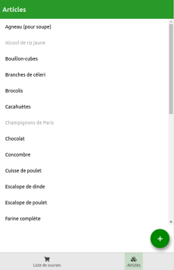
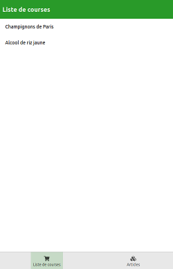
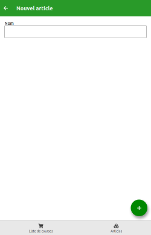

# ezwn-shoppinglist

This is a very simple shopping list manager. At the beginning, this project was only intended to be a demonstration of ezwn-ux-native (a ux react-native library), but it finally became usefull, so I decided to publish it under this name.

## Screenshots

| The article list        | The shopping list           | Adding a new article  |
|:-------------:|:-------------:|:-----:|
|  |  |  |

## Compilation

To compile you need to clone ezwn-ux-native and ezwn-storage-native (available from my github) into the lib folder.

## The author

This project has been developed by Nicolas Enzweiler.

E-Mail address: [nicolas.enzweiler@gmail.com](mailto:nicolas.enzweiler@gmail.com)

Github : [https://github.com/ezwn](https://github.com/ezwn)
